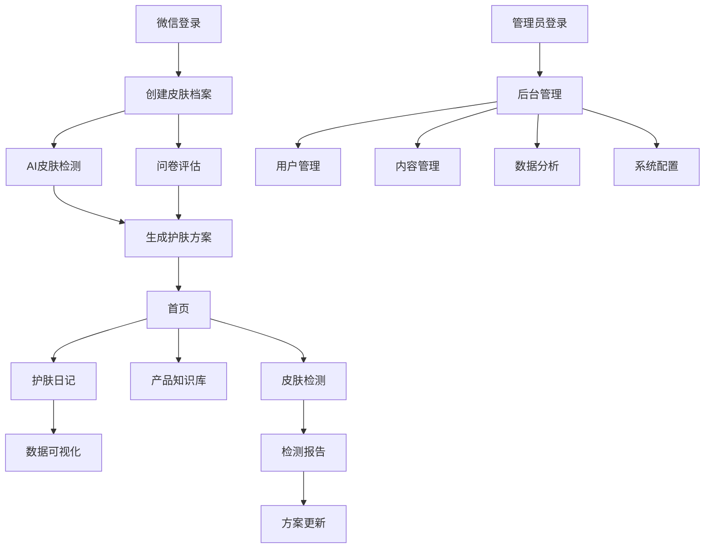

# Skin-care 护肤微信小程序产品需求文档

## 1. Product Overview

Skin-care 是一款专为谷雨品牌打造的智能护肤微信小程序，集成AI皮肤检测、个性化护肤方案和产品知识库。通过科技赋能提升用户护肤体验，为品牌收集用户数据并提供专业的护肤指导服务。

## 2. Core Features

### 2.1 User Roles

| Role | Registration Method | Core Permissions |
|------|---------------------|------------------|
| 普通用户 | 微信一键登录 + 手机号绑定 | 皮肤检测、护肤日记、产品浏览、个性化方案 |
| 管理员 | 后台系统分配 | 用户管理、内容管理、数据分析、系统配置 |

### 2.2 Feature Module

我们的护肤小程序包含以下核心页面：

1. **首页**：品牌展示、快速检测入口、每日护肤提醒
2. **皮肤检测页**：AI拍照检测、问卷评估、检测报告、历史对比
3. **个人档案页**：皮肤档案、护肤方案、数据趋势
4. **护肤日记页**：每日打卡、图文记录、数据可视化、智能分析
5. **产品知识库页**：产品详情、成分词典、搭配推荐、使用指南
6. **个人中心页**：用户信息、设置选项、隐私管理、客服支持

### 2.3 Page Details

| Page Name | Module Name | Feature description |
|-----------|-------------|---------------------|
| 首页 | 品牌展示区 | 展示谷雨品牌形象、最新产品推荐、护肤小贴士轮播 |
| 首页 | 快速检测入口 | 一键进入AI皮肤检测、显示上次检测结果摘要 |
| 首页 | 每日提醒 | 基于用户习惯的个性化护肤提醒、天气相关建议 |
| 皮肤检测页 | AI拍照检测 | 调用摄像头拍照、实时人脸识别、多角度检测引导 |
| 皮肤检测页 | 智能分析 | AI分析肤质、肤色、毛孔、痘痘、皱纹等指标 |
| 皮肤检测页 | 检测报告 | 生成详细报告、问题诊断、改善建议、产品推荐 |
| 个人档案页 | 皮肤档案 | 展示皮肤基础信息、历史检测数据、变化趋势 |
| 个人档案页 | 护肤方案 | 个性化日夜护肤流程、产品使用顺序、手法指导 |
| 护肤日记页 | 每日打卡 | 快速记录使用产品、皮肤状态、心情感受 |
| 护肤日记页 | 图文记录 | 上传皮肤照片、详细文字记录、标签分类 |
| 护肤日记页 | 数据可视化 | 折线图显示皮肤指标变化、雷达图对比分析 |
| 产品知识库页 | 产品详情 | 产品介绍、成分列表、功效说明、适用肤质 |
| 产品知识库页 | 成分词典 | 成分科学解释、功效机理、安全性说明 |
| 产品知识库页 | 搭配推荐 | 智能推荐产品组合、搭配逻辑说明 |
| 个人中心页 | 用户设置 | 个人信息编辑、隐私设置、通知偏好 |
| 个人中心页 | 数据管理 | 检测历史查看、数据导出、账户注销 |

## 3. Core Process

### 普通用户流程
用户首次使用小程序时，通过微信登录并完成皮肤档案创建，包括AI检测和问卷填写。系统生成个性化护肤方案后，用户可以每日记录护肤日记，定期进行皮肤检测跟踪变化。同时可以浏览产品知识库学习护肤知识，获得专业的护肤指导。

### 管理员流程
管理员通过后台系统登录，可以管理用户信息、审核和发布产品内容、查看数据分析报告、配置系统参数。管理员还可以监控系统运行状态，处理用户反馈和客服请求。

## 4. User Interface Design

### 4.1 Design Style

- **主色调**：谷雨品牌绿 (#4CAF50)，辅助色为清新蓝 (#E3F2FD)
- **按钮样式**：圆角矩形按钮，渐变效果，3D轻微阴影
- **字体**：微信小程序默认字体，标题16px，正文14px，说明文字12px
- **布局风格**：卡片式设计，顶部导航，底部Tab栏，清新简洁
- **图标风格**：线性图标为主，配合品牌色彩，支持护肤相关emoji表情

### 4.2 Page Design Overview

| Page Name | Module Name | UI Elements |
|-----------|-------------|-------------|
| 首页 | 品牌展示区 | 渐变背景，品牌Logo，轮播图，卡片式布局 |
| 首页 | 快速检测 | 圆形检测按钮，进度环显示，绿色主题色 |
| 皮肤检测页 | 拍照界面 | 全屏相机，人脸识别框，引导动画 |
| 皮肤检测页 | 分析界面 | 加载动画，进度条，分析步骤提示 |
| 检测报告页 | 结果展示 | 雷达图，评分卡片，颜色编码（红黄绿） |
| 护肤日记页 | 打卡界面 | 日历视图，打卡状态图标，连续天数显示 |
| 护肤日记页 | 记录界面 | 表单输入，图片上传，标签选择 |
| 产品页面 | 产品卡片 | 产品图片，评分星级，收藏按钮，详情链接 |
| 个人中心页 | 设置界面 | 列表式布局，开关按钮，导航箭头 |

### 4.3 Responsiveness

小程序采用移动端优先设计，适配不同尺寸的手机屏幕。界面支持触摸操作优化，包括滑动、点击、长按等手势。所有交互元素符合微信小程序设计规范，确保良好的用户体验。