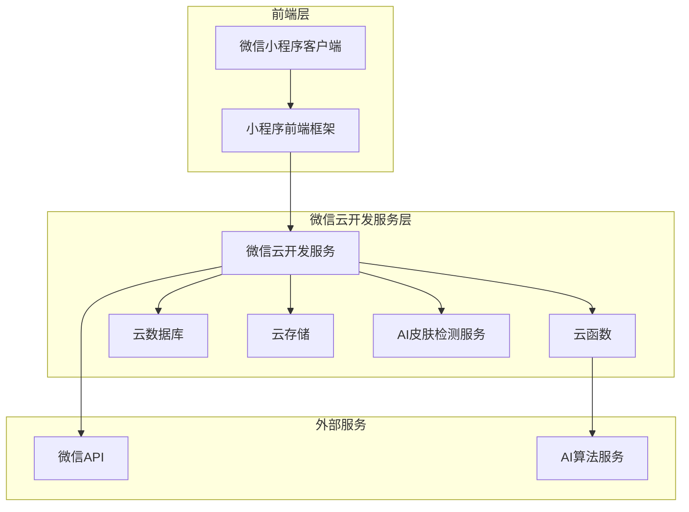
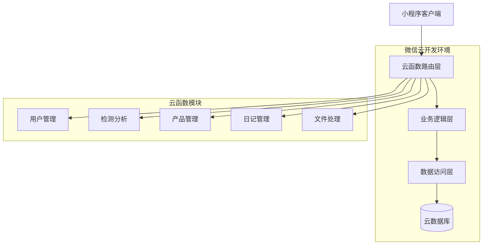
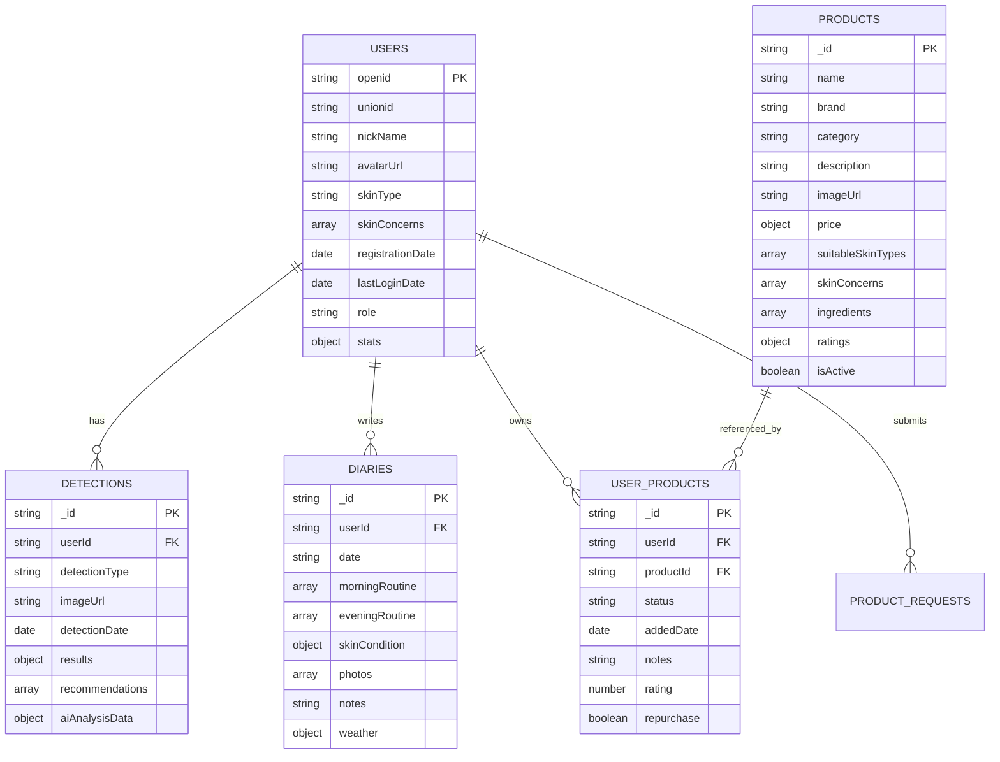

# Skin-care 护肤微信小程序技术架构文档

## 1. Architecture design



## 2. Technology Description

* **前端**: 微信小程序原生框架 + WXML + WXSS + JavaScript ES6

* **后端**: 微信云开发（云函数 + 云数据库 + 云存储）

* **数据库**: 云开发数据库（基于MongoDB的文档数据库）

* **存储**: 云开发存储（图片、文件存储）

* **AI服务**: 腾讯云AI + 自研皮肤检测算法

* **基础库版本**: 微信小程序基础库 3.10.3

## 3. Route definitions

| Route                          | Purpose          |
| ------------------------------ | ---------------- |
| /pages/index/index             | 首页，展示品牌信息和快速检测入口 |
| /pages/detection/detection     | 皮肤检测页面，AI拍照检测功能  |
| /pages/report/report           | 检测报告页面，显示分析结果和建议 |
| /pages/profile/profile         | 个人档案页面，皮肤档案和护肤方案 |
| /pages/diary/diary             | 护肤日记页面，每日打卡和记录   |
| /pages/products/products       | 产品知识库页面，产品列表和搜索  |
| /pages/products/detail         | 产品详情页面，成分分析和使用指南 |
| /pages/ingredients/ingredients | 成分词典页面，成分科学解释    |
| /pages/user/user               | 个人中心页面，用户设置和客服   |
| /pages/login/login             | 登录页面，微信授权登录      |
| /pages/admin/manage            | 管理后台页面，产品管理和用户管理 |
| /pages/my-products/my-products | 我的用品页面，个人护肤品管理   |

## 4. API definitions

### 4.1 云函数API

#### 用户认证相关

**用户登录**

```
云函数: login
```

请求参数:

| Param Name | Param Type | isRequired | Description    |
| ---------- | ---------- | ---------- | -------------- |
| userInfo   | object     | false      | 用户基本信息（昵称、头像等） |

响应参数:

| Param Name     | Param Type | Description |
| -------------- | ---------- | ----------- |
| code           | number     | 返回码（0为成功）   |
| message        | string     | 返回消息        |
| data.openid    | string     | 用户微信openid  |
| data.user      | object     | 用户信息对象      |
| data.isNewUser | boolean    | 是否为新用户      |

#### 皮肤检测相关

**AI皮肤检测分析**

```
云函数: detectionAnalyze
```

请求参数:

| Param Name    | Param Type | isRequired | Description                  |
| ------------- | ---------- | ---------- | ---------------------------- |
| imageUrl      | string     | true       | 检测图片的云存储URL                  |
| userId        | string     | true       | 用户openid                     |
| detectionType | string     | true       | 检测类型（face/eye/comprehensive） |

**获取检测历史**

```
云函数: detectionHistory
```

请求参数:

| Param Name | Param Type | isRequired | Description |
| ---------- | ---------- | ---------- | ----------- |
| userId     | string     | true       | 用户openid    |
| limit      | number     | false      | 返回记录数量限制    |

#### 产品管理相关

**产品搜索**

```
云函数: productsSearch
```

请求参数:

| Param Name | Param Type | isRequired | Description |
| ---------- | ---------- | ---------- | ----------- |
| keyword    | string     | false      | 搜索关键词       |
| category   | string     | false      | 产品分类筛选      |
| brand      | string     | false      | 品牌筛选        |
| skinType   | string     | false      | 适用肌肤类型      |
| page       | number     | false      | 页码          |
| limit      | number     | false      | 每页数量        |

**获取品牌列表**

```
云函数: brandsList
```

#### 护肤日记相关

**创建日记**

```
云函数: diaryCreate
```

请求参数:

| Param Name     | Param Type | isRequired | Description      |
| -------------- | ---------- | ---------- | ---------------- |
| userId         | string     | true       | 用户openid         |
| date           | string     | true       | 日记日期（YYYY-MM-DD） |
| morningRoutine | array      | false      | 晨间护肤流程           |
| eveningRoutine | array      | false      | 晚间护肤流程           |
| skinCondition  | object     | false      | 皮肤状态评估           |
| notes          | string     | false      | 文字记录             |
| images         | array      | false      | 图片URL数组          |

**获取日记列表**

```
云函数: diaryList
```

**获取日记统计**

```
云函数: diaryStats
```

#### 文件上传相关

**上传文件到云存储**

```
云函数: uploadFile
```

请求参数:

| Param Name | Param Type | isRequired | Description |
| ---------- | ---------- | ---------- | ----------- |
| filePath   | string     | true       | 本地文件路径      |
| cloudPath  | string     | true       | 云存储路径       |

## 5. Server architecture diagram



## 6. Data model

### 6.1 Data model definition



### 6.2 Data Definition Language

**用户集合 (users)**

```javascript
// 云数据库集合：users
{
  _id: "用户唯一ID",
  openid: "微信用户openid",
  unionid: "微信开放平台unionid",
  nickName: "用户昵称",
  avatarUrl: "头像URL",
  gender: 0, // 0-未知 1-男 2-女
  city: "城市",
  province: "省份",
  country: "国家",
  skinType: "oily|dry|combination|sensitive|normal",
  skinConcerns: ["acne", "aging", "pigmentation"],
  registrationDate: new Date(),
  lastLoginDate: new Date(),
  role: "user|admin",
  stats: {
    detectionCount: 0,
    diaryCount: 0,
    favoriteCount: 0
  }
}
```

**云函数目录结构**

```
cloudfunctions/
├── login/                    # 用户登录
├── getUserInfo/             # 获取用户信息
├── detectionAnalyze/        # AI皮肤检测分析
├── detectionHistory/       # 获取检测历史
├── detectionReport/        # 生成检测报告
├── productsSearch/        # 产品搜索
├── brandsList/           # 获取品牌列表
├── getIngredients/       # 获取成分信息
├── diaryCreate/          # 创建护肤日记
├── diaryList/            # 获取日记列表
├── diaryUpdate/          # 更新日记
├── diaryDelete/          # 删除日记
├── diaryStats/           # 获取日记统计
├── addUserProduct/      # 添加用户产品
├── getUserProducts/     # 获取用户产品
├── removeUserProduct/   # 移除用户产品
├── updateUserProduct/   # 更新用户产品
├── submitProductRequest/ # 提交产品请求
├── getProductRequests/   # 获取产品请求
├── processProductRequest/ # 处理产品请求
├── uploadFile/          # 文件上传
└── userProfile/         # 用户资料管理
```

