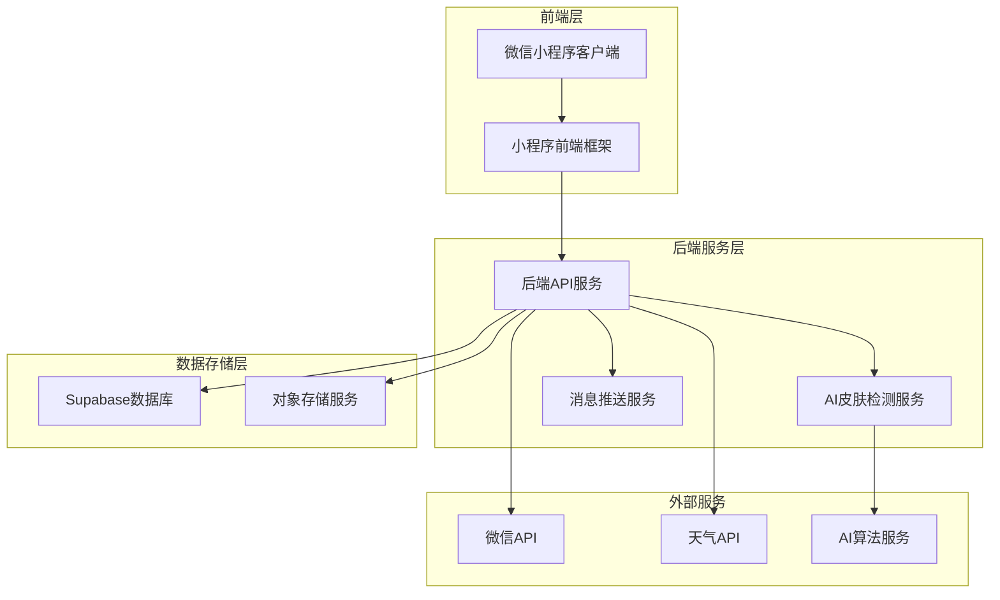
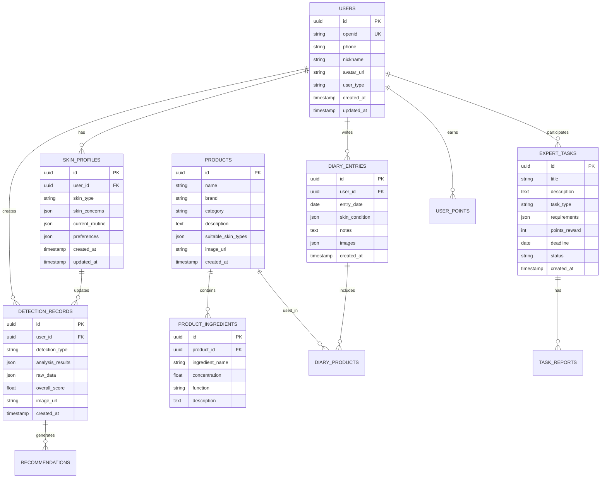

# Skin-care 护肤微信小程序技术架构文档

## 1. Architecture design



## 2. Technology Description

- **前端**: 微信小程序原生框架 + WeUI组件库 + ECharts图表库
- **后端**: Node.js + Express.js + JWT认证
- **数据库**: Supabase (PostgreSQL)
- **存储**: Supabase Storage (图片、视频存储)
- **AI服务**: 腾讯云AI + 自研皮肤检测算法
- **缓存**: Redis (用户会话、检测结果缓存)

## 3. Route definitions

| Route | Purpose |
|-------|---------|
| /pages/index/index | 首页，展示品牌信息和快速检测入口 |
| /pages/detection/detection | 皮肤检测页面，AI拍照检测功能 |
| /pages/report/report | 检测报告页面，显示分析结果和建议 |
| /pages/profile/profile | 个人档案页面，皮肤档案和护肤方案 |
| /pages/diary/diary | 护肤日记页面，每日打卡和记录 |
| /pages/diary/add | 添加日记页面，图文记录功能 |
| /pages/products/products | 产品知识库页面，产品列表和搜索 |
| /pages/products/detail | 产品详情页面，成分分析和使用指南 |
| /pages/ingredients/ingredients | 成分词典页面，成分科学解释 |
| /pages/expert/expert | 体验官中心页面，任务和积分管理 |
| /pages/expert/tasks | 任务详情页面，任务领取和提交 |
| /pages/expert/community | 内测社群页面，体验官交流 |
| /pages/user/user | 个人中心页面，用户设置和客服 |
| /pages/login/login | 登录页面，微信授权登录 |

## 4. API definitions

### 4.1 Core API

#### 用户认证相关

```
POST /api/auth/login
```

Request:
| Param Name | Param Type | isRequired | Description |
|------------|------------|------------|-------------|
| code | string | true | 微信登录凭证 |
| userInfo | object | false | 用户基本信息 |

Response:
| Param Name | Param Type | Description |
|------------|------------|-------------|
| token | string | JWT访问令牌 |
| user | object | 用户信息 |
| isNewUser | boolean | 是否为新用户 |

#### 皮肤检测相关

```
POST /api/detection/analyze
```

Request:
| Param Name | Param Type | isRequired | Description |
|------------|------------|------------|-------------|
| image | string | true | Base64编码的皮肤照片 |
| userId | string | true | 用户ID |
| detectionType | string | true | 检测类型(face/eye/lip) |

Response:
| Param Name | Param Type | Description |
|------------|------------|-------------|
| detectionId | string | 检测记录ID |
| results | object | 检测结果数据 |
| recommendations | array | 护肤建议列表 |
| score | number | 综合评分 |

```
GET /api/detection/history/{userId}
```

Response:
| Param Name | Param Type | Description |
|------------|------------|-------------|
| detections | array | 历史检测记录 |
| trends | object | 趋势分析数据 |

#### 护肤日记相关

```
POST /api/diary/create
```

Request:
| Param Name | Param Type | isRequired | Description |
|------------|------------|------------|-------------|
| userId | string | true | 用户ID |
| date | string | true | 日记日期 |
| products | array | false | 使用的产品列表 |
| skinCondition | object | false | 皮肤状态记录 |
| notes | string | false | 文字记录 |
| images | array | false | 图片URL列表 |

#### 产品知识库相关

```
GET /api/products/list
```

Query Parameters:
| Param Name | Param Type | isRequired | Description |
|------------|------------|------------|-------------|
| category | string | false | 产品分类 |
| skinType | string | false | 适用肤质 |
| page | number | false | 页码 |
| limit | number | false | 每页数量 |

```
GET /api/products/{productId}
```

Response:
| Param Name | Param Type | Description |
|------------|------------|-------------|
| product | object | 产品详细信息 |
| ingredients | array | 成分列表 |
| recommendations | array | 搭配推荐 |

#### 体验官系统相关

```
GET /api/expert/tasks
```

Response:
| Param Name | Param Type | Description |
|------------|------------|-------------|
| tasks | array | 可领取任务列表 |
| myTasks | array | 我的任务列表 |

```
POST /api/expert/report/submit
```

Request:
| Param Name | Param Type | isRequired | Description |
|------------|------------|------------|-------------|
| taskId | string | true | 任务ID |
| report | object | true | 报告内容 |
| beforeImages | array | false | 使用前照片 |
| afterImages | array | false | 使用后照片 |

## 5. Server architecture diagram


## 6. Data model

### 6.1 Data model definition



### 6.2 Data Definition Language

#### 用户表 (users)
```sql
-- 创建用户表
CREATE TABLE users (
    id UUID PRIMARY KEY DEFAULT gen_random_uuid(),
    openid VARCHAR(100) UNIQUE NOT NULL,
    phone VARCHAR(20),
    nickname VARCHAR(50),
    avatar_url TEXT,
    user_type VARCHAR(20) DEFAULT 'normal' CHECK (user_type IN ('normal', 'expert', 'admin')),
    created_at TIMESTAMP WITH TIME ZONE DEFAULT NOW(),
    updated_at TIMESTAMP WITH TIME ZONE DEFAULT NOW()
);

-- 创建索引
CREATE INDEX idx_users_openid ON users(openid);
CREATE INDEX idx_users_user_type ON users(user_type);
```

#### 皮肤档案表 (skin_profiles)
```sql
-- 创建皮肤档案表
CREATE TABLE skin_profiles (
    id UUID PRIMARY KEY DEFAULT gen_random_uuid(),
    user_id UUID NOT NULL REFERENCES users(id) ON DELETE CASCADE,
    skin_type VARCHAR(20) CHECK (skin_type IN ('dry', 'oily', 'combination', 'sensitive', 'normal')),
    skin_concerns JSONB DEFAULT '[]',
    current_routine JSONB DEFAULT '{}',
    preferences JSONB DEFAULT '{}',
    created_at TIMESTAMP WITH TIME ZONE DEFAULT NOW(),
    updated_at TIMESTAMP WITH TIME ZONE DEFAULT NOW()
);

-- 创建索引
CREATE INDEX idx_skin_profiles_user_id ON skin_profiles(user_id);
```

#### 检测记录表 (detection_records)
```sql
-- 创建检测记录表
CREATE TABLE detection_records (
    id UUID PRIMARY KEY DEFAULT gen_random_uuid(),
    user_id UUID NOT NULL REFERENCES users(id) ON DELETE CASCADE,
    detection_type VARCHAR(20) NOT NULL CHECK (detection_type IN ('face', 'eye', 'lip')),
    analysis_results JSONB NOT NULL,
    raw_data JSONB,
    overall_score DECIMAL(3,1) CHECK (overall_score >= 0 AND overall_score <= 10),
    image_url TEXT,
    created_at TIMESTAMP WITH TIME ZONE DEFAULT NOW()
);

-- 创建索引
CREATE INDEX idx_detection_records_user_id ON detection_records(user_id);
CREATE INDEX idx_detection_records_created_at ON detection_records(created_at DESC);
```

#### 产品表 (products)
```sql
-- 创建产品表
CREATE TABLE products (
    id UUID PRIMARY KEY DEFAULT gen_random_uuid(),
    name VARCHAR(100) NOT NULL,
    brand VARCHAR(50) DEFAULT '谷雨',
    category VARCHAR(30) NOT NULL,
    description TEXT,
    suitable_skin_types JSONB DEFAULT '[]',
    image_url TEXT,
    price DECIMAL(10,2),
    status VARCHAR(20) DEFAULT 'active' CHECK (status IN ('active', 'inactive', 'discontinued')),
    created_at TIMESTAMP WITH TIME ZONE DEFAULT NOW(),
    updated_at TIMESTAMP WITH TIME ZONE DEFAULT NOW()
);

-- 创建索引
CREATE INDEX idx_products_category ON products(category);
CREATE INDEX idx_products_brand ON products(brand);
```

#### 护肤日记表 (diary_entries)
```sql
-- 创建护肤日记表
CREATE TABLE diary_entries (
    id UUID PRIMARY KEY DEFAULT gen_random_uuid(),
    user_id UUID NOT NULL REFERENCES users(id) ON DELETE CASCADE,
    entry_date DATE NOT NULL,
    skin_condition JSONB DEFAULT '{}',
    notes TEXT,
    images JSONB DEFAULT '[]',
    mood_score INTEGER CHECK (mood_score >= 1 AND mood_score <= 5),
    created_at TIMESTAMP WITH TIME ZONE DEFAULT NOW(),
    updated_at TIMESTAMP WITH TIME ZONE DEFAULT NOW(),
    UNIQUE(user_id, entry_date)
);

-- 创建索引
CREATE INDEX idx_diary_entries_user_date ON diary_entries(user_id, entry_date DESC);
```

#### 体验官任务表 (expert_tasks)
```sql
-- 创建体验官任务表
CREATE TABLE expert_tasks (
    id UUID PRIMARY KEY DEFAULT gen_random_uuid(),
    title VARCHAR(100) NOT NULL,
    description TEXT,
    task_type VARCHAR(30) NOT NULL CHECK (task_type IN ('product_trial', 'survey', 'content_creation')),
    requirements JSONB DEFAULT '{}',
    points_reward INTEGER DEFAULT 0,
    max_participants INTEGER,
    current_participants INTEGER DEFAULT 0,
    deadline DATE,
    status VARCHAR(20) DEFAULT 'active' CHECK (status IN ('active', 'paused', 'completed', 'cancelled')),
    created_at TIMESTAMP WITH TIME ZONE DEFAULT NOW(),
    updated_at TIMESTAMP WITH TIME ZONE DEFAULT NOW()
);

-- 创建索引
CREATE INDEX idx_expert_tasks_status ON expert_tasks(status);
CREATE INDEX idx_expert_tasks_deadline ON expert_tasks(deadline);
```

#### 权限设置
```sql
-- 为匿名用户授予基本读取权限
GRANT SELECT ON products TO anon;
GRANT SELECT ON product_ingredients TO anon;

-- 为认证用户授予完整权限
GRANT ALL PRIVILEGES ON users TO authenticated;
GRANT ALL PRIVILEGES ON skin_profiles TO authenticated;
GRANT ALL PRIVILEGES ON detection_records TO authenticated;
GRANT ALL PRIVILEGES ON diary_entries TO authenticated;
GRANT ALL PRIVILEGES ON expert_tasks TO authenticated;
GRANT ALL PRIVILEGES ON products TO authenticated;
GRANT ALL PRIVILEGES ON product_ingredients TO authenticated;
```

#### 初始化数据
```sql
-- 插入示例产品数据
INSERT INTO products (name, category, description, suitable_skin_types, price) VALUES
('谷雨光感水', '爽肤水', '温和补水，提亮肤色', '["normal", "dry", "combination"]', 128.00),
('谷雨修护精华', '精华', '深层修护，改善肌肤屏障', '["sensitive", "dry"]', 298.00),
('谷雨清洁面膜', '面膜', '深层清洁，收缩毛孔', '["oily", "combination"]', 89.00);

-- 插入示例任务数据
INSERT INTO expert_tasks (title, description, task_type, points_reward, max_participants, deadline) VALUES
('新品精华试用体验', '试用谷雨新款精华产品，记录使用感受', 'product_trial', 500, 20, '2024-03-31'),
('护肤习惯调研', '参与护肤习惯问卷调研', 'survey', 100, 100, '2024-02-29');
```