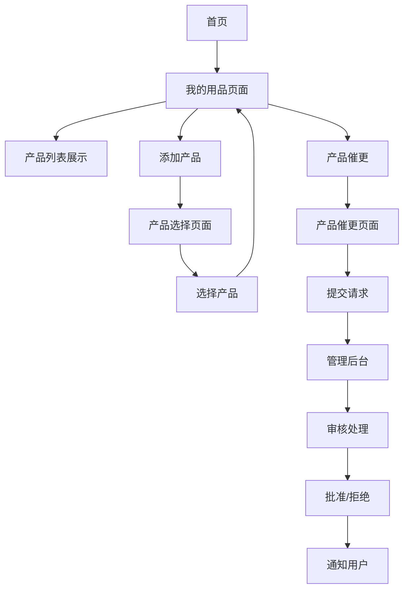

# 我的用品功能产品需求文档

## 1. 产品概述

我的用品功能是护肤小程序的核心功能之一，允许用户管理个人护肤品收藏，从产品库中选择产品添加到个人列表，并支持产品催更请求。该功能旨在帮助用户建立个人护肤品档案，提升产品管理体验，同时为平台收集用户需求数据。

## 2. 核心功能

### 2.1 用户角色

| 角色 | 注册方式 | 核心权限 |
|------|----------|----------|
| 普通用户 | 微信授权登录 | 可管理个人护肤品列表、提交产品催更请求 |
| 管理员 | 后台分配权限 | 可查看和处理产品催更请求、管理产品库 |

### 2.2 功能模块

我的用品功能包含以下主要页面：
1. **首页入口**：在现有首页添加我的用品功能卡片
2. **我的用品页面**：用户个人护肤品管理中心，包含产品列表、统计信息、筛选搜索
3. **产品选择页面**：从产品库中选择产品添加到个人列表
4. **产品催更页面**：用户提交新产品信息请求
5. **管理后台扩展**：管理员处理产品催更请求

### 2.3 页面详情

| 页面名称 | 模块名称 | 功能描述 |
|----------|----------|----------|
| 首页 | 我的用品入口 | 添加我的用品功能卡片，显示用户拥有产品数量统计，点击跳转到我的用品页面 |
| 我的用品页面 | 统计信息区 | 显示总产品数量、品牌数量、最近添加的产品等统计信息 |
| 我的用品页面 | 产品列表区 | 展示用户拥有的护肤品列表，支持网格和列表两种显示模式 |
| 我的用品页面 | 筛选搜索区 | 支持按品牌、类别、状态筛选，支持产品名称搜索 |
| 我的用品页面 | 操作按钮区 | 添加产品按钮、产品催更按钮、批量管理按钮 |
| 产品选择页面 | 产品库展示 | 展示所有可选择的产品，支持分类浏览和搜索 |
| 产品选择页面 | 选择操作 | 支持单选或多选产品，添加到个人列表 |
| 产品催更页面 | 信息填写表单 | 产品名称输入、品牌选择、类别选择、产品描述输入 |
| 产品催更页面 | 图片上传 | 支持拍照或从相册选择产品图片，最多上传3张 |
| 管理后台 | 催更请求列表 | 显示所有用户提交的产品催更请求，支持状态筛选 |
| 管理后台 | 请求处理 | 审核、批准、拒绝产品催更请求，添加处理备注 |

## 3. 核心流程

### 普通用户流程
用户从首页点击"我的用品"进入个人护肤品管理页面，可以查看已添加的产品列表。点击"添加产品"进入产品选择页面，从产品库中选择产品添加到个人列表。如果找不到想要的产品，可以点击"产品催更"提交新产品信息请求，包括产品名称、品牌、图片等信息。

### 管理员流程
管理员通过管理后台查看用户提交的产品催更请求，可以审核请求内容，决定是否批准。批准后可以将产品信息添加到产品库中，拒绝的请求会通知用户并说明原因。

## 4. 用户界面设计

### 4.1 设计风格
- **主色调**：#4CAF50（绿色）作为主色，#FFF（白色）作为背景色
- **辅助色**：#FF9800（橙色）用于强调按钮，#757575（灰色）用于次要文本
- **按钮样式**：圆角矩形按钮，主要按钮使用渐变效果
- **字体**：系统默认字体，标题16px，正文14px，辅助文本12px
- **布局风格**：卡片式布局，顶部导航栏，底部标签栏
- **图标风格**：线性图标，简洁现代，与整体设计风格保持一致

### 4.2 页面设计概览

| 页面名称 | 模块名称 | UI元素 |
|----------|----------|--------|
| 首页 | 我的用品卡片 | 绿色渐变背景，白色图标和文字，显示产品数量徽章，卡片阴影效果 |
| 我的用品页面 | 顶部统计区 | 白色背景卡片，绿色数字显示，灰色描述文字，网格布局展示统计信息 |
| 我的用品页面 | 筛选搜索栏 | 白色背景，圆角搜索框，筛选标签使用胶囊样式，选中状态为绿色 |
| 我的用品页面 | 产品列表 | 卡片式布局，产品图片圆角处理，品牌和名称层次分明，状态标签右上角显示 |
| 产品选择页面 | 产品网格 | 2列网格布局，产品卡片包含图片、名称、品牌，选中状态显示绿色勾选图标 |
| 产品催更页面 | 表单区域 | 白色背景，输入框使用下划线样式，图片上传区域虚线边框，提交按钮绿色渐变 |

### 4.3 响应式设计
产品采用移动端优先设计，适配不同尺寸的手机屏幕。主要适配iPhone和Android设备，支持竖屏显示，针对小屏幕设备优化触摸交互体验。