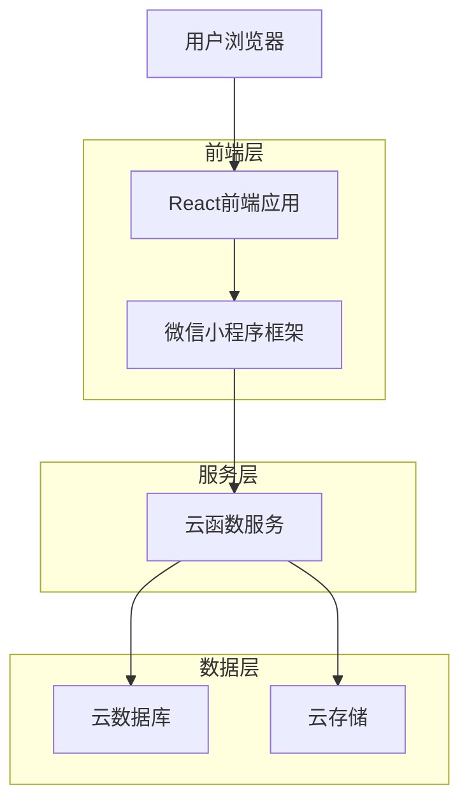
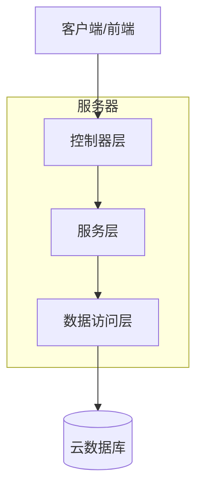
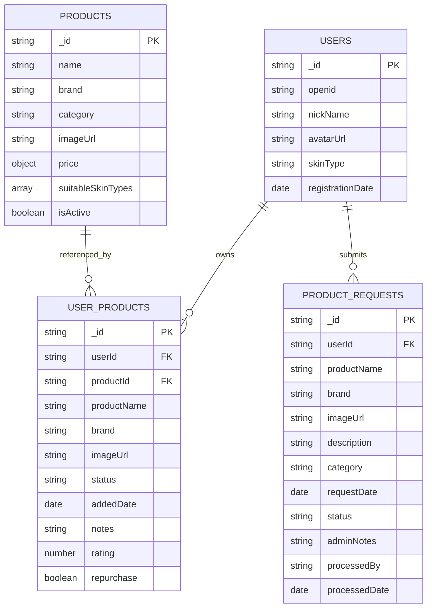

# 我的用品功能技术架构文档

## 1. 架构设计



## 2. 技术描述

- 前端：微信小程序原生框架 + WXML + WXSS + JavaScript
- 后端：微信云开发 + 云函数 + 云数据库 + 云存储
- 数据库：云开发数据库（基于MongoDB）

## 3. 路由定义

| 路由 | 用途 |
|------|-----|
| /pages/index/index | 首页，显示主要功能入口包括我的用品 |
| /pages/my-products/my-products | 我的用品页面，用户个人护肤品管理中心 |
| /pages/product-select/product-select | 产品选择页面，从产品库中选择产品 |
| /pages/product-request/product-request | 产品催更页面，用户提交新产品请求 |
| /pages/admin/manage | 管理后台，处理产品催更请求 |

## 4. API定义

### 4.1 核心API

#### 用户个人产品管理相关

**获取用户个人产品列表**
```
云函数: getUserOwnedProducts
```

请求参数:
| 参数名 | 参数类型 | 是否必需 | 描述 |
|--------|----------|----------|------|
| userId | string | true | 用户ID |
| page | number | false | 页码，默认1 |
| limit | number | false | 每页数量，默认20 |
| status | string | false | 产品状态筛选 |
| category | string | false | 产品类别筛选 |

响应参数:
| 参数名 | 参数类型 | 描述 |
|--------|----------|------|
| success | boolean | 请求是否成功 |
| data | array | 产品列表数据 |
| total | number | 总数量 |

示例:
```json
{
  "success": true,
  "data": [
    {
      "_id": "user_product_id",
      "userId": "user123",
      "productId": "product456",
      "productName": "月见仙人掌水乳套装",
      "brand": "谷雨",
      "imageUrl": "cloud://...",
      "status": "active",
      "addedDate": "2024-01-15T10:30:00.000Z"
    }
  ],
  "total": 15
}
```

**添加产品到个人列表**
```
云函数: addUserProduct
```

请求参数:
| 参数名 | 参数类型 | 是否必需 | 描述 |
|--------|----------|----------|------|
| userId | string | true | 用户ID |
| productId | string | true | 产品ID |
| notes | string | false | 个人备注 |

**移除个人产品**
```
云函数: removeUserProduct
```

请求参数:
| 参数名 | 参数类型 | 是否必需 | 描述 |
|--------|----------|----------|------|
| userId | string | true | 用户ID |
| userProductId | string | true | 用户产品记录ID |

#### 产品催更相关

**提交产品催更请求**
```
云函数: submitProductRequest
```

请求参数:
| 参数名 | 参数类型 | 是否必需 | 描述 |
|--------|----------|----------|------|
| userId | string | true | 用户ID |
| productName | string | true | 产品名称 |
| brand | string | false | 品牌名称 |
| imageUrl | string | false | 产品图片URL |
| description | string | false | 产品描述 |
| category | string | false | 产品类别 |

**获取产品催更请求列表（管理员）**
```
云函数: getProductRequests
```

请求参数:
| 参数名 | 参数类型 | 是否必需 | 描述 |
|--------|----------|----------|------|
| adminId | string | true | 管理员ID |
| status | string | false | 请求状态筛选 |
| page | number | false | 页码 |
| limit | number | false | 每页数量 |

**处理产品催更请求（管理员）**
```
云函数: processProductRequest
```

请求参数:
| 参数名 | 参数类型 | 是否必需 | 描述 |
|--------|----------|----------|------|
| adminId | string | true | 管理员ID |
| requestId | string | true | 请求ID |
| action | string | true | 操作类型：approve/reject |
| adminNotes | string | false | 管理员备注 |

## 5. 服务架构图



## 6. 数据模型

### 6.1 数据模型定义



### 6.2 数据定义语言

#### user_products 集合（用户个人护肤品）
```javascript
// 创建集合（通过第一次写入数据自动创建）
db.collection('user_products').add({
  data: {
    userId: 'user123',
    productId: 'product456',
    productName: '月见仙人掌水乳套装',
    brand: '谷雨',
    imageUrl: 'cloud://cloud1-7grsf5bufd76f124.636c-cloud1-7grsf5bufd76f124-1384119240/products/skincare_set/月见仙人掌补水系列-月见仙人掌水乳套装.png',
    status: 'active', // active, used_up, discontinued
    addedDate: new Date(),
    purchaseDate: null,
    expiryDate: null,
    notes: '',
    rating: 0,
    repurchase: false
  }
})

// 创建索引
// 在云开发控制台数据库页面，选择user_products集合，点击"索引"标签
// 添加以下索引：
// 1. userId: 普通索引
// 2. productId: 普通索引  
// 3. status: 普通索引
// 4. addedDate: 普通索引（降序）
```

#### product_requests 集合（产品催更请求）
```javascript
// 创建集合（通过第一次写入数据自动创建）
db.collection('product_requests').add({
  data: {
    userId: 'user123',
    productName: '新产品名称',
    brand: '品牌名称',
    imageUrl: 'cloud://uploaded-image-url',
    description: '产品描述',
    category: 'cleanser',
    requestDate: new Date(),
    status: 'pending', // pending, approved, rejected, completed
    adminNotes: '',
    processedBy: '',
    processedDate: null,
    createdProductId: ''
  }
})

// 创建索引
// 在云开发控制台数据库页面，选择product_requests集合，点击"索引"标签
// 添加以下索引：
// 1. userId: 普通索引
// 2. status: 普通索引
// 3. requestDate: 普通索引（降序）
// 4. processedBy: 普通索引
```

#### 数据库权限设置
```javascript
// 在云开发控制台数据库页面，点击"数据库权限"
// 为user_products集合设置权限：
{
  "read": "auth.uid == resource.userId",
  "write": "auth.uid == resource.userId"
}

// 为product_requests集合设置权限：
{
  "read": "auth.uid == resource.userId || get('users', auth.uid).isAdmin == true",
  "write": "auth.uid == resource.userId || get('users', auth.uid).isAdmin == true"
}
```