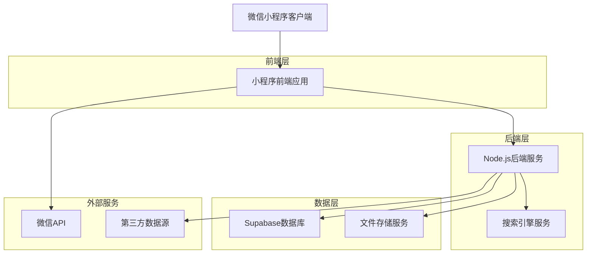
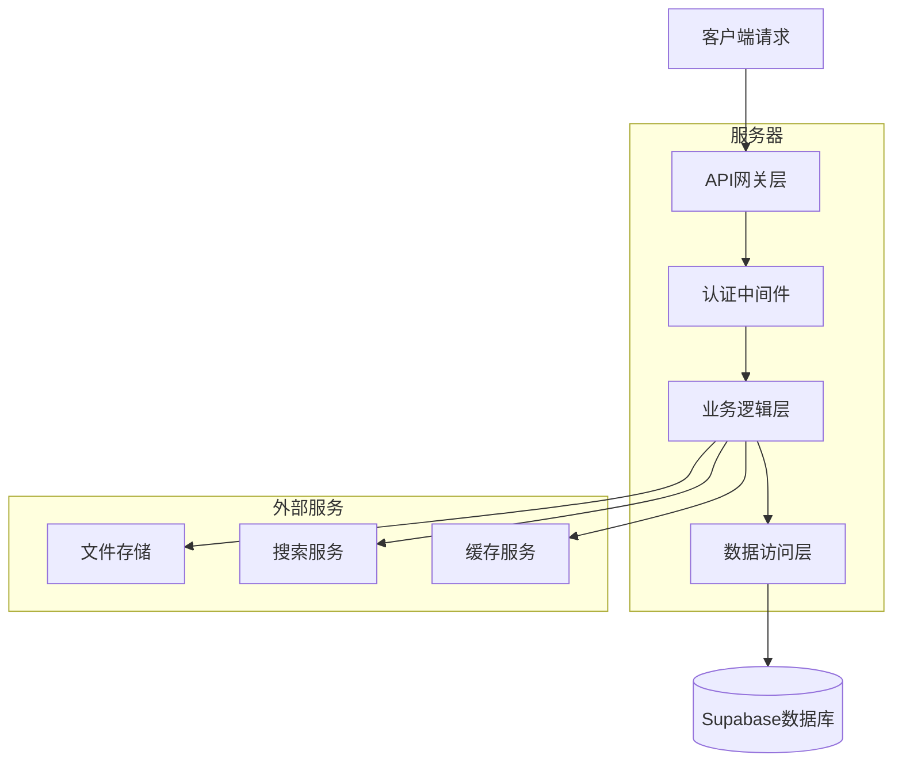
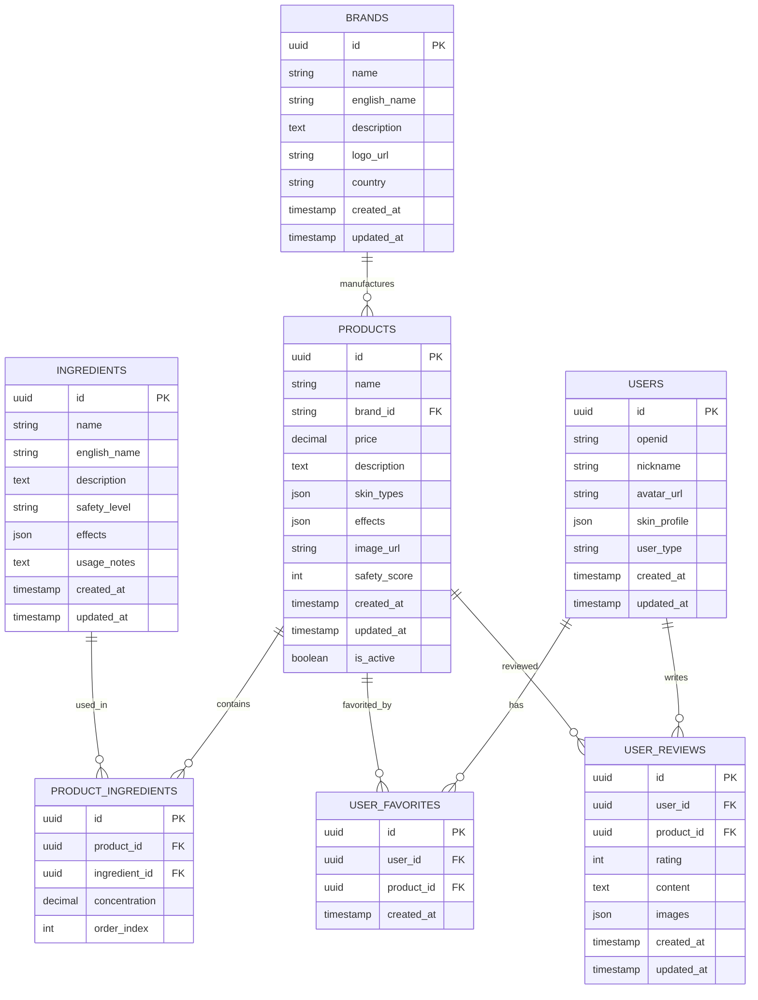

# 护肤小程序产品知识库技术架构文档

## 1. 架构设计



## 2. 技术描述

- 前端：微信小程序原生开发 + WeUI组件库
- 后端：Node.js + Express.js + JWT认证
- 数据库：Supabase (PostgreSQL)
- 文件存储：Supabase Storage
- 搜索：Elasticsearch或内置全文搜索
- 缓存：Redis

## 3. 路由定义

| 路由 | 用途 |
|------|-----|
| /pages/products/products | 产品知识库主页，展示产品列表和搜索功能 |
| /pages/products/detail | 产品详情页，显示完整产品信息和成分分析 |
| /pages/ingredients/ingredients | 成分数据库页面，成分查询和详细信息 |
| /pages/brands/brands | 品牌管理页面，品牌信息和产品关联 |
| /pages/admin/upload | 管理后台上传页面，批量和单个产品数据录入 |
| /pages/admin/manage | 管理后台管理页面，产品信息编辑和审核 |
| /pages/user/favorites | 用户收藏页面，个人收藏产品管理 |
| /pages/user/profile | 用户设置页面，个人偏好和推荐配置 |

## 4. API定义

### 4.1 核心API

#### 产品管理相关

```
GET /api/products
```

请求参数:
| 参数名称 | 参数类型 | 是否必需 | 描述 |
|----------|----------|----------|------|
| page | number | false | 页码，默认1 |
| limit | number | false | 每页数量，默认20 |
| keyword | string | false | 搜索关键词 |
| brand | string | false | 品牌筛选 |
| skinType | string | false | 适用肌肤类型 |
| priceRange | string | false | 价格区间 |

响应数据:
| 参数名称 | 参数类型 | 描述 |
|----------|----------|------|
| success | boolean | 请求状态 |
| data | object | 产品列表数据 |
| total | number | 总数量 |

示例:
```json
{
  "success": true,
  "data": {
    "products": [
      {
        "id": "1",
        "name": "兰蔻小黑瓶精华",
        "brand": "兰蔻",
        "price": 680,
        "image": "https://example.com/image.jpg",
        "skinTypes": ["干性", "混合性"],
        "effects": ["抗衰老", "保湿"]
      }
    ],
    "total": 150
  }
}
```

#### 数据上传相关

```
POST /api/admin/products/upload
```

请求参数:
| 参数名称 | 参数类型 | 是否必需 | 描述 |
|----------|----------|----------|------|
| file | File | true | Excel/CSV文件 |
| type | string | true | 上传类型：batch/single |

响应数据:
| 参数名称 | 参数类型 | 描述 |
|----------|----------|------|
| success | boolean | 上传状态 |
| message | string | 结果信息 |
| errors | array | 错误详情 |

#### 成分管理相关

```
GET /api/ingredients
```

请求参数:
| 参数名称 | 参数类型 | 是否必需 | 描述 |
|----------|----------|----------|------|
| name | string | false | 成分名称 |
| safetyLevel | string | false | 安全等级 |

响应数据:
| 参数名称 | 参数类型 | 描述 |
|----------|----------|------|
| success | boolean | 请求状态 |
| data | array | 成分列表 |

## 5. 服务器架构图



## 6. 数据模型

### 6.1 数据模型定义



### 6.2 数据定义语言

#### 产品表 (products)
```sql
-- 创建产品表
CREATE TABLE products (
    id UUID PRIMARY KEY DEFAULT gen_random_uuid(),
    name VARCHAR(255) NOT NULL,
    brand_id UUID REFERENCES brands(id),
    price DECIMAL(10,2),
    description TEXT,
    skin_types JSONB DEFAULT '[]',
    effects JSONB DEFAULT '[]',
    image_url VARCHAR(500),
    safety_score INTEGER DEFAULT 0,
    is_active BOOLEAN DEFAULT true,
    created_at TIMESTAMP WITH TIME ZONE DEFAULT NOW(),
    updated_at TIMESTAMP WITH TIME ZONE DEFAULT NOW()
);

-- 创建索引
CREATE INDEX idx_products_brand_id ON products(brand_id);
CREATE INDEX idx_products_name ON products USING gin(to_tsvector('chinese', name));
CREATE INDEX idx_products_active ON products(is_active);
CREATE INDEX idx_products_created_at ON products(created_at DESC);

-- 权限设置
GRANT SELECT ON products TO anon;
GRANT ALL PRIVILEGES ON products TO authenticated;
```

#### 成分表 (ingredients)
```sql
-- 创建成分表
CREATE TABLE ingredients (
    id UUID PRIMARY KEY DEFAULT gen_random_uuid(),
    name VARCHAR(255) NOT NULL UNIQUE,
    english_name VARCHAR(255),
    description TEXT,
    safety_level VARCHAR(20) DEFAULT 'safe' CHECK (safety_level IN ('safe', 'caution', 'warning')),
    effects JSONB DEFAULT '[]',
    usage_notes TEXT,
    created_at TIMESTAMP WITH TIME ZONE DEFAULT NOW(),
    updated_at TIMESTAMP WITH TIME ZONE DEFAULT NOW()
);

-- 创建索引
CREATE INDEX idx_ingredients_name ON ingredients USING gin(to_tsvector('chinese', name));
CREATE INDEX idx_ingredients_safety_level ON ingredients(safety_level);

-- 权限设置
GRANT SELECT ON ingredients TO anon;
GRANT ALL PRIVILEGES ON ingredients TO authenticated;
```

#### 品牌表 (brands)
```sql
-- 创建品牌表
CREATE TABLE brands (
    id UUID PRIMARY KEY DEFAULT gen_random_uuid(),
    name VARCHAR(255) NOT NULL UNIQUE,
    english_name VARCHAR(255),
    description TEXT,
    logo_url VARCHAR(500),
    country VARCHAR(100),
    created_at TIMESTAMP WITH TIME ZONE DEFAULT NOW(),
    updated_at TIMESTAMP WITH TIME ZONE DEFAULT NOW()
);

-- 创建索引
CREATE INDEX idx_brands_name ON brands USING gin(to_tsvector('chinese', name));
CREATE INDEX idx_brands_country ON brands(country);

-- 权限设置
GRANT SELECT ON brands TO anon;
GRANT ALL PRIVILEGES ON brands TO authenticated;
```

#### 产品成分关联表 (product_ingredients)
```sql
-- 创建产品成分关联表
CREATE TABLE product_ingredients (
    id UUID PRIMARY KEY DEFAULT gen_random_uuid(),
    product_id UUID REFERENCES products(id) ON DELETE CASCADE,
    ingredient_id UUID REFERENCES ingredients(id) ON DELETE CASCADE,
    concentration DECIMAL(5,2),
    order_index INTEGER DEFAULT 0,
    UNIQUE(product_id, ingredient_id)
);

-- 创建索引
CREATE INDEX idx_product_ingredients_product_id ON product_ingredients(product_id);
CREATE INDEX idx_product_ingredients_ingredient_id ON product_ingredients(ingredient_id);

-- 权限设置
GRANT SELECT ON product_ingredients TO anon;
GRANT ALL PRIVILEGES ON product_ingredients TO authenticated;
```

#### 用户表 (users)
```sql
-- 创建用户表
CREATE TABLE users (
    id UUID PRIMARY KEY DEFAULT gen_random_uuid(),
    openid VARCHAR(255) UNIQUE NOT NULL,
    nickname VARCHAR(100),
    avatar_url VARCHAR(500),
    skin_profile JSONB DEFAULT '{}',
    user_type VARCHAR(20) DEFAULT 'normal' CHECK (user_type IN ('normal', 'vip', 'admin')),
    created_at TIMESTAMP WITH TIME ZONE DEFAULT NOW(),
    updated_at TIMESTAMP WITH TIME ZONE DEFAULT NOW()
);

-- 创建索引
CREATE INDEX idx_users_openid ON users(openid);
CREATE INDEX idx_users_type ON users(user_type);

-- 权限设置
GRANT SELECT ON users TO authenticated;
GRANT ALL PRIVILEGES ON users TO authenticated;
```

#### 初始化数据
```sql
-- 插入示例品牌数据
INSERT INTO brands (name, english_name, description, country) VALUES
('兰蔻', 'Lancome', '法国高端化妆品品牌', '法国'),
('雅诗兰黛', 'Estee Lauder', '美国知名护肤品牌', '美国'),
('SK-II', 'SK-II', '日本高端护肤品牌', '日本');

-- 插入示例成分数据
INSERT INTO ingredients (name, english_name, description, safety_level, effects) VALUES
('透明质酸', 'Hyaluronic Acid', '强效保湿成分，能够吸收自身重量1000倍的水分', 'safe', '["保湿", "抗衰老"]'),
('烟酰胺', 'Niacinamide', '维生素B3衍生物，具有美白和控油功效', 'safe', '["美白", "控油", "收缩毛孔"]'),
('水杨酸', 'Salicylic Acid', 'β羟基酸，具有去角质和抗痘功效', 'caution', '["去角质", "抗痘", "疏通毛孔"]');
```