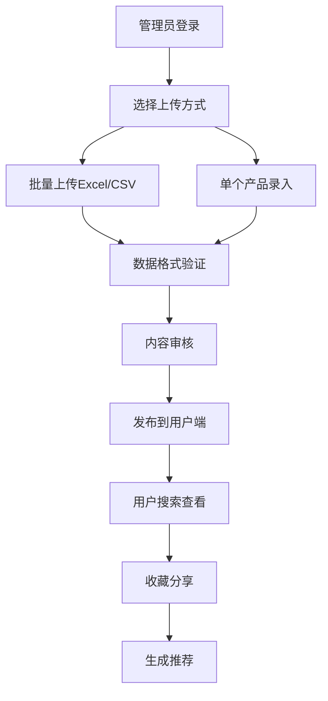

# 护肤小程序产品知识库管理系统需求文档

## 1. 产品概述

护肤小程序产品知识库管理系统是一个专业的护肤品信息管理平台，为用户提供全面的产品信息查询、成分分析和个性化推荐服务。系统支持管理员批量上传和管理产品数据，为用户提供准确、专业的护肤品选择指导。

该系统解决了用户在选择护肤品时信息不对称的问题，通过专业的成分分析和产品评价，帮助用户做出更明智的护肤品选择决策。目标是成为最权威的护肤品信息查询平台，服务于广大护肤爱好者和专业人士。

## 2. 核心功能

### 2.1 用户角色

| 角色 | 注册方式 | 核心权限 |
|------|----------|----------|
| 普通用户 | 微信授权登录 | 浏览产品信息、搜索筛选、收藏分享、查看推荐 |
| VIP用户 | 付费升级 | 享有普通用户权限 + 高级筛选、专属推荐、无广告体验 |
| 管理员 | 后台分配账号 | 产品数据管理、用户管理、内容审核、系统配置 |
| 超级管理员 | 系统预设 | 拥有所有权限 + 管理员权限管理、系统维护 |

### 2.2 功能模块

我们的产品知识库管理系统包含以下主要页面：

1. **产品知识库页面**：产品搜索筛选、产品详情展示、收藏分享功能
2. **管理后台页面**：数据上传管理、产品信息编辑、用户权限管理
3. **成分数据库页面**：成分信息查询、安全性评级、功效说明
4. **品牌管理页面**：品牌信息展示、产品关联管理
5. **用户中心页面**：个人收藏、浏览历史、推荐设置

### 2.3 页面详情

| 页面名称 | 模块名称 | 功能描述 |
|----------|----------|----------|
| 产品知识库页面 | 搜索筛选模块 | 支持关键词搜索、多维度筛选（品牌、价格、肌肤类型、功效等） |
| 产品知识库页面 | 产品列表模块 | 展示产品卡片、分页加载、排序功能 |
| 产品知识库页面 | 产品详情模块 | 显示产品完整信息、成分分析、用户评价、相关推荐 |
| 管理后台页面 | 数据上传模块 | 支持Excel/CSV批量上传、单个产品手动添加、数据验证 |
| 管理后台页面 | 产品管理模块 | 产品信息编辑、删除、审核、状态管理 |
| 管理后台页面 | 用户管理模块 | 用户权限设置、数据统计、行为分析 |
| 成分数据库页面 | 成分查询模块 | 成分搜索、详细信息展示、安全性评级 |
| 成分数据库页面 | 成分管理模块 | 成分信息录入编辑、功效标签管理、关联产品展示 |
| 品牌管理页面 | 品牌展示模块 | 品牌信息展示、产品关联、关注功能 |
| 品牌管理页面 | 品牌管理模块 | 品牌信息维护、产品关联管理、数据统计 |
| 用户中心页面 | 个人收藏模块 | 收藏产品管理、分类整理、快速访问 |
| 用户中心页面 | 推荐设置模块 | 肌肤类型设置、偏好配置、推荐算法调整 |

## 3. 核心流程

### 管理员流程
管理员登录后台 → 选择数据上传方式（批量/单个） → 填写/上传产品信息 → 系统数据验证 → 审核发布 → 用户端展示

### 普通用户流程
用户进入产品页面 → 使用搜索/筛选功能 → 浏览产品列表 → 查看产品详情 → 收藏/分享产品 → 获取个性化推荐

### 数据管理流程
数据导入 → 格式验证 → 重复检查 → 内容审核 → 发布上线 → 用户反馈 → 数据优化

## 4. 用户界面设计

### 4.1 设计风格
- **主色调**：清新绿色 (#4CAF50) 和纯净白色 (#FFFFFF)
- **辅助色**：浅灰色 (#F5F5F5) 和深灰色 (#333333)
- **按钮样式**：圆角矩形，渐变背景，微阴影效果
- **字体**：系统默认字体，标题16-18px，正文14-16px，说明文字12-14px
- **布局风格**：卡片式设计，顶部导航，网格布局
- **图标风格**：线性图标配合emoji表情，简洁现代

### 4.2 页面设计概览

| 页面名称 | 模块名称 | UI元素 |
|----------|----------|--------|
| 产品知识库页面 | 搜索筛选模块 | 搜索框采用圆角设计，筛选标签使用胶囊形状，颜色为浅绿色背景白色文字 |
| 产品知识库页面 | 产品卡片模块 | 白色背景卡片，圆角12px，产品图片占比1:1，信息区域采用左对齐布局 |
| 管理后台页面 | 上传界面模块 | 拖拽上传区域使用虚线边框，支持文件预览，进度条显示上传状态 |
| 成分数据库页面 | 成分卡片模块 | 安全等级用颜色标识（绿色安全、黄色注意、红色警告），功效标签采用彩色胶囊设计 |

### 4.3 响应式设计
系统采用移动端优先设计，完美适配微信小程序环境，支持触摸操作优化，确保在不同屏幕尺寸下都能提供良好的用户体验。