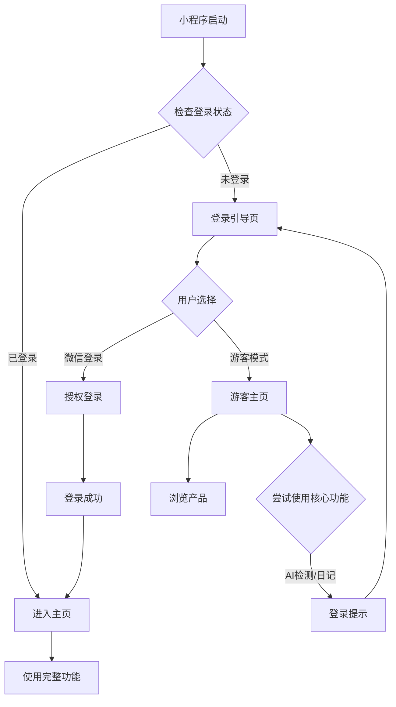

# 微信小程序登录状态检查与用户引导产品需求文档

## 1. Product Overview

本项目旨在优化SkinCare微信小程序的用户登录体验，通过在应用启动时统一检查登录状态，确保核心功能（AI皮肤检测、护肤日记）的正常使用。解决当前用户进入功能页面后才被提示登录的体验问题，提升用户使用流程的连贯性和便利性。

## 2. Core Features

### 2.1 User Roles

| Role | Registration Method | Core Permissions |
|------|---------------------|------------------|
| 注册用户 | 微信一键登录 | 可使用所有功能：AI检测、日记记录、产品推荐、历史查看等 |
| 游客用户 | 跳过登录进入 | 仅可浏览产品信息，无法使用AI检测和日记功能 |

### 2.2 Feature Module

我们的登录状态检查与用户引导需求包含以下主要页面优化：

1. **应用启动页**：登录状态检查、用户引导逻辑
2. **登录引导页**：统一登录入口、功能介绍、游客模式选择
3. **主页面**：根据登录状态显示不同内容和功能入口
4. **功能页面**：AI检测页、日记页的登录状态适配

### 2.3 Page Details

| Page Name | Module Name | Feature description |
|-----------|-------------|---------------------|
| 应用启动页 | 登录状态检查 | 检查本地存储的用户登录信息，验证登录状态有效性 |
| 应用启动页 | 路由决策 | 根据登录状态自动跳转到相应页面（主页或登录页） |
| 登录引导页 | 功能介绍 | 展示AI检测、日记功能的价值，引导用户登录 |
| 登录引导页 | 登录选项 | 提供微信一键登录、游客模式两种选择 |
| 登录引导页 | 登录流程 | 处理微信授权、用户信息获取、登录状态保存 |
| 主页面 | 功能状态显示 | 根据用户登录状态显示可用功能和限制提示 |
| 主页面 | 登录提示 | 为游客用户提供登录引导入口 |
| AI检测页 | 登录验证 | 页面加载时检查登录状态，未登录直接跳转登录页 |
| AI检测页 | 功能限制 | 游客用户显示功能介绍和登录引导 |
| 日记页 | 登录验证 | 页面加载时检查登录状态，确保用户身份 |
| 日记页 | 数据权限 | 根据用户ID加载个人日记数据 |

## 3. Core Process

### 注册用户流程
用户启动小程序 → 检测到已登录状态 → 直接进入主页 → 可正常使用所有功能

### 新用户流程
用户启动小程序 → 检测到未登录 → 跳转登录引导页 → 查看功能介绍 → 选择微信登录 → 授权成功 → 进入主页 → 使用完整功能

### 游客用户流程
用户启动小程序 → 检测到未登录 → 跳转登录引导页 → 选择游客模式 → 进入主页 → 浏览产品信息 → 尝试使用AI检测/日记 → 提示登录 → 可选择登录或继续浏览

## 4. User Interface Design

### 4.1 Design Style

- **主色调**：#6C5CE7（紫色）作为主色，#A29BFE（浅紫色）作为辅助色
- **按钮样式**：圆角按钮，渐变背景，微阴影效果
- **字体**：系统默认字体，标题16px，正文14px，辅助文字12px
- **布局风格**：卡片式布局，顶部导航，底部Tab导航
- **图标样式**：线性图标配合emoji表情，简洁现代

### 4.2 Page Design Overview

| Page Name | Module Name | UI Elements |
|-----------|-------------|-------------|
| 应用启动页 | 加载动画 | 品牌Logo居中显示，下方loading动画，背景渐变色#6C5CE7到#A29BFE |
| 登录引导页 | 品牌区域 | Logo + 品牌名称 + Slogan，白色背景，紫色文字 |
| 登录引导页 | 功能介绍 | 三个功能卡片横向排列，每个卡片包含图标、标题、描述 |
| 登录引导页 | 登录按钮 | 微信绿色登录按钮，游客模式为灰色文字链接 |
| 主页面 | 用户状态栏 | 顶部显示用户头像、昵称，游客用户显示"游客模式"标识 |
| 主页面 | 功能入口 | 大卡片式功能入口，未登录功能显示锁定图标和"需要登录"提示 |
| AI检测页 | 登录提示卡片 | 居中显示，包含功能说明、登录按钮，卡片阴影效果 |
| 日记页 | 空状态页面 | 未登录时显示插画 + 文字说明 + 登录按钮 |

### 4.3 Responsiveness

产品采用移动端优先设计，专为微信小程序环境优化，支持不同屏幕尺寸的iPhone和Android设备，重点优化触摸交互体验。