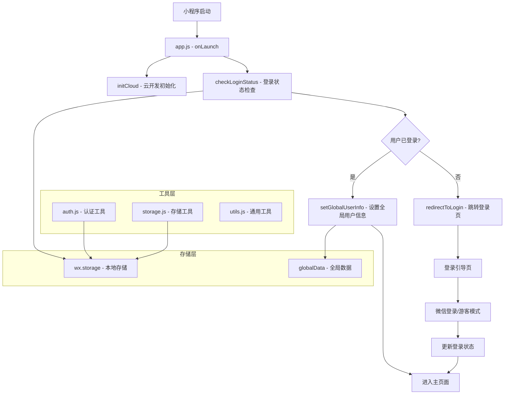
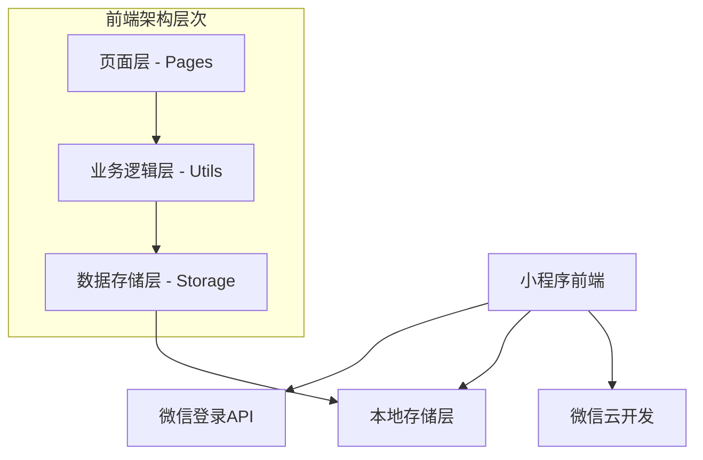
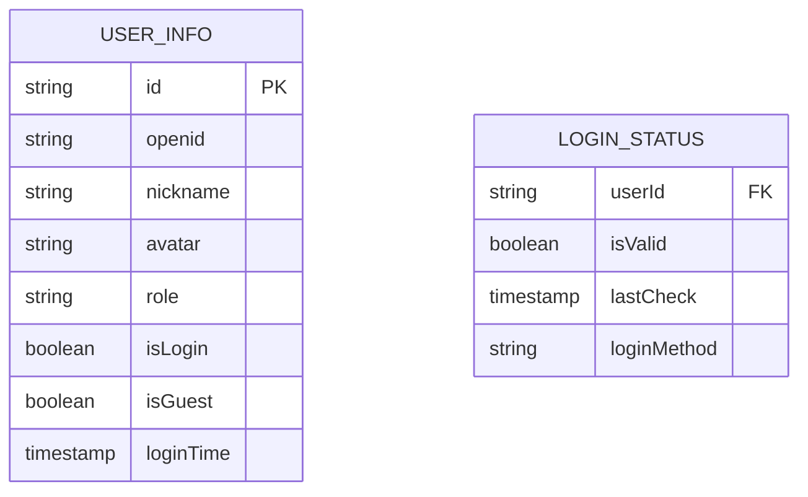

# 微信小程序登录状态检查技术架构文档

## 1. Architecture Design



## 2. Technology Description

- **前端框架**：微信小程序原生框架
- **状态管理**：app.globalData + 本地存储
- **云服务**：微信云开发（可选）
- **工具库**：自定义utils工具集

## 3. Route Definitions

| Route | Purpose | Login Required |
|-------|---------|----------------|
| /pages/index/index | 主页，显示功能入口和用户状态 | 否（但功能受限） |
| /pages/login/login | 登录引导页，处理用户登录流程 | 否 |
| /pages/detection/detection | AI皮肤检测功能页面 | 是 |
| /pages/diary/diary | 护肤日记功能页面 | 是 |
| /pages/products/products | 产品浏览页面 | 否 |
| /pages/user/user | 用户个人中心页面 | 否（未登录显示登录入口） |

## 4. API Definitions

### 4.1 登录状态检查相关

**检查登录状态**
```javascript
// utils/auth.js
function isLoggedIn()
```

返回值:
| Param Name | Param Type | Description |
|-----------|-------------|-------------|
| result | boolean | 用户是否已登录 |

**获取用户信息**
```javascript
// utils/auth.js  
function getUserInfo()
```

返回值:
| Param Name | Param Type | Description |
|-----------|-------------|-------------|
| userInfo | object/null | 用户信息对象或null |

**设置用户信息**
```javascript
// app.js
setUserInfo(userInfo)
```

请求参数:
| Param Name | Param Type | isRequired | Description |
|-----------|-------------|-------------|-------------|
| userInfo | object | true | 用户信息对象 |

### 4.2 页面跳转控制

**跳转到登录页**
```javascript
// utils/auth.js
function redirectToLogin()
```

**检查页面访问权限**
```javascript
// utils/auth.js
function checkPageAccess(pageName)
```

请求参数:
| Param Name | Param Type | isRequired | Description |
|-----------|-------------|-------------|-------------|
| pageName | string | true | 页面名称标识 |

## 5. Server Architecture Diagram



## 6. Data Model

### 6.1 Data Model Definition



### 6.2 Data Definition Language

**用户信息存储结构**
```javascript
// 本地存储 - userInfo
const userInfo = {
    id: 'string',              // 用户唯一标识
    openid: 'string',          // 微信openid
    nickname: 'string',        // 用户昵称
    avatar: 'string',          // 头像URL
    role: 'string',            // 用户角色：user/guest
    isLogin: 'boolean',        // 登录状态
    isGuest: 'boolean',        // 是否游客模式
    loginTime: 'timestamp',    // 登录时间
    loginMethod: 'string'      // 登录方式：wechat/guest
}

// 全局数据结构
app.globalData = {
    userInfo: null,            // 当前用户信息
    cloudEnabled: false,       // 云开发是否可用
    isLoggedIn: false,         // 登录状态标识
    systemInfo: {}             // 系统信息
}
```

**登录状态检查逻辑**
```javascript
// app.js - 启动时检查
onLaunch() {
    this.initCloud()
    this.checkLoginStatus()
    this.initApp()
}

// 登录状态检查方法
checkLoginStatus() {
    const userInfo = wx.getStorageSync('userInfo')
    if (userInfo && userInfo.openid) {
        // 验证登录状态有效性
        this.globalData.userInfo = userInfo
        this.globalData.isLoggedIn = true
    } else {
        // 未登录，跳转登录页
        this.redirectToLogin()
    }
}

// 跳转登录页方法
redirectToLogin() {
    wx.reLaunch({
        url: '/pages/login/login'
    })
}
```